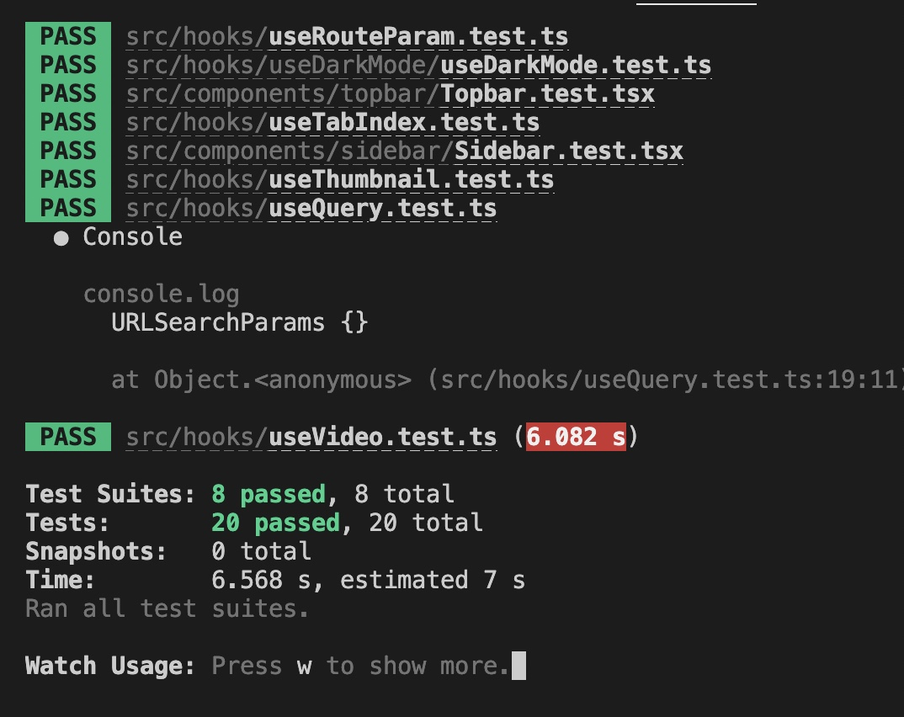
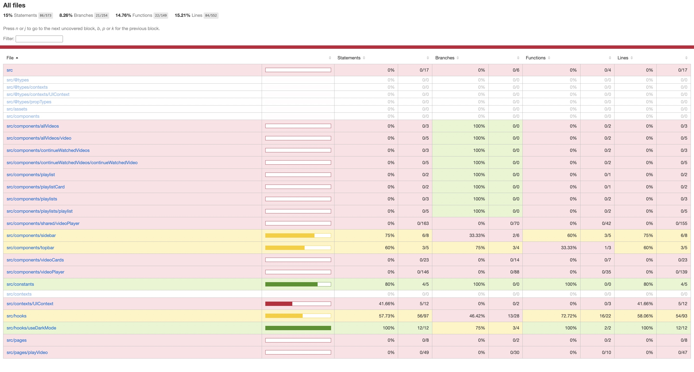

# Features of the Video Player (Header)

-   Video Playing
-   Picture-in-Picture Video Playing
-   Playback speed configuration
-   Volume control
-   Dynamic Placeholder generation
-   Starting video where left off
-   Play/Pause Video
-   Download Video
-   Drag and Drop for reordering of playlist

# Project Structure

-   **.firebase**: Contains Firebase configuration files.
-   **.vscode**: Contains settings specific to Visual Studio Code.
-   **build**: Contains all the build files for the React app.
-   **public**: Contains the public directory provided out-of-the-box by create-react-app.
-   **src**: Contains the source code of the React app.
    -   **@types**: Contains all the type declarations.
    -   **assets**: Contains assets required for the app.
    -   **components**: Contains all the components for the app.
        -   **allVideos**: Responsible for displaying a list of videos.
        -   **continueWatchedVideos**: Responsible for displaying the already watched videos.
        -   **playlists**: Responsible for displaying the list of playlists.
        -   **playlistCard**: Contains UI component for displaying the playlist as a card.
        -   **sidebar**: Contains UI component for the sidebar.
        -   **topbar**: Contains UI component for the topbar.
        -   **videoCards**: Contains UI components for showing a video as a card. Capable of autoplaying and generating thumbnails for the videos.
        -   **videoPlayer**: Contains UI component for the video player.
    -   **constants**: Contains the constants and the dummy states for the videos.
    -   **context**: Contains the context providers for state management.
    -   **hooks**: Contains all the custom hooks and tests for the hooks.
    -   **pages**: Contains components rendering a page.
    -   **App.tsx**: Contains the routes for the React app.
    -   **index.css**: The general global CSS file.
    -   **index.tsx**: The index file for the React app provided out-of-the-box by create-react-app.
    -   **react-app-env.d.ts**: TypeScript module file provided out-of-the-box by create-react-app.
    -   **reportWebVitals.ts**: Provided out-of-the-box by create-react-app.
    -   **setupTests.ts**: For setting up tests using RTL and Jest.
-   **.eslintrc.js**: ESLint configuration.
-   **prettierrc.json**: Prettier configuration.
-   **package.json**: For package management.
-   **postcss.config.js**: For Tailwind CSS configuration.
-   **tailwind.config.js**: For Tailwind CSS configuration.
-   **tsconfig.json**: TypeScript configuration file.

# Third-Party Dependencies

-   "firebase": "^10.8.0" -> for hosting
-   "react-beautiful-dnd": "^13.1.1" -> for drag and drop reordering playlists
-   "react-icons": "^5.0.1" -> for icons

# Third-Party Dev Dependencies

-   "autoprefixer": "^10.4.17" -> for tailwindCSS
-   "eslint": "^8.14.0" -> linting for code quality
-   "eslint-config-prettier": "^8.5.0" -> linting for code quality
-   "eslint-plugin-prettier": "^4.0.0" -> linting for code quality
-   "eslint-plugin-react": "^7.29.4" -> linting for code quality
-   "eslint-plugin-react-hooks": "^4.5.0" -> linting for code quality
-   "postcss": "^8.4.35" -> for tailwindCSS
-   "prettier": "^2.6.2" -> for code styling
-   "tailwindcss": "^3.4.1" -> for tailwindCSS

# Hosted Link

-   https://react-video-player-60552.web.app

# Lighthouse Report

-   https://googlechrome.github.io/lighthouse/viewer/?psiurl=https%3A%2F%2Freact-video-player-60552.web.app%2F&strategy=mobile&category=performance&category=accessibility&category=best-practices&category=seo&category=pwa&utm_source=lh-chrome-ext

# TESTS

# COVERAGE REPORT

-   Can be found in coverage/lcov-report/index.htmk

